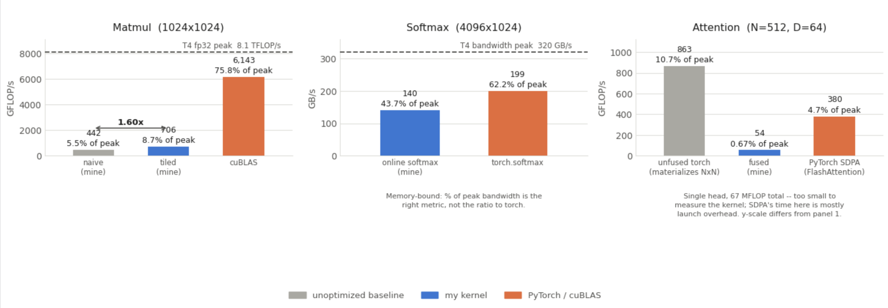

# CUDA Kernels for Attention Inference

A progressive build-up of custom CUDA kernels, from a first vector-add to a
fused, simplified flash-attention-style kernel — each step benchmarked
against the previous one and against PyTorch/cuBLAS.

**The story:** naive → tiled → fused → benchmarked. Each kernel exists to
motivate the next: naive matmul shows the cost of re-reading global memory,
tiled matmul fixes that with shared memory, fused softmax introduces the
online-softmax trick used again in the final attention kernel, and the
attention kernel fuses QK^T + softmax + the weighted sum over V into a
single pass that never materializes the full attention matrix.

## What's here

```
kernels/
  01_vector_add.cu                  # syntax fundamentals
  02_matmul_naive.cu                # baseline: no shared memory
  03_matmul_tiled.cu                # shared-memory tiling, benchmarked vs naive
  04_softmax_fused.cu               # online softmax, warp-shuffle reduction
  05_flash_attention_simplified.cu  # fused QK^T + softmax + weighted-V kernel
notebooks/
  cuda_kernels_colab.ipynb          # runs everything on a free Colab T4 GPU
results/
  benchmark_comparison.png          # generated by the notebook — commit after running
Makefile                            # local build, if you have a CUDA-capable machine
```

## Running it

**Colab (no local GPU needed):** open `notebooks/cuda_kernels_colab.ipynb` in
Google Colab, set the runtime to a GPU (T4 on the free tier), and run the
cells top to bottom. Each kernel is written to disk, compiled with `nvcc`,
run, and benchmarked against the PyTorch/cuBLAS equivalent.

**Local machine with an NVIDIA GPU:**

```bash
make          # builds every kernel into build/
make run      # builds and runs each one in sequence
```

If your GPU isn't a T4, edit the `ARCH` variable in the `Makefile` (or the
`-arch=sm_75` flag in the notebook) to match your compute capability —
`sm_80` for A100, `sm_86` for RTX 30-series, `sm_89` for RTX 40-series,
`sm_90` for H100.

## Results

Measured on a Google Colab **Tesla T4** (compute capability 7.5), fp32. Every
kernel passed its correctness check against a CPU or PyTorch reference.

| Kernel | My implementation | PyTorch / cuBLAS | Correctness |
|---|---|---|---|
| Matmul, naive (1024×1024) | 5.630 ms (381 GFLOP/s) | — | passed |
| Matmul, tiled (1024×1024) | 3.533 ms (608 GFLOP/s) | 0.699 ms (cuBLAS) | passed, matches naive exactly |
| Softmax (4096×1024) | 0.277 ms (121 GB/s) | 0.167 ms (torch.softmax) | passed |
| Attention (N=512, D=64) | 3.401 ms | 0.160 ms (SDPA) | passed |

**Tiled vs. naive matmul: 1.59× speedup** from shared-memory tiling alone.

The production baselines (cuBLAS, PyTorch's fused `scaled_dot_product_attention`)
are still faster than these kernels — as expected. cuBLAS uses far more aggressive
register blocking, vectorized loads, and Tensor Cores; PyTorch's SDPA dispatches to
a real FlashAttention implementation. The point of this project is not to beat them,
but to implement the core ideas from scratch, measure honestly against them, and be
able to explain the remaining gap (occupancy, memory-access patterns, lack of
register blocking, no Tensor Core usage).



## What each kernel demonstrates

- **`01_vector_add.cu`** — thread indexing, host/device memory management, error checking.
- **`02_matmul_naive.cu`** — the un-optimized baseline every matmul optimization is measured against.
- **`03_matmul_tiled.cu`** — shared-memory tiling to cut global memory traffic; the standard "do you understand the memory hierarchy" exercise.
- **`04_softmax_fused.cu`** — the online/streaming softmax algorithm (single pass, running max + running sum) reduced across a warp with `__shfl_down_sync` instead of shared memory.
- **`05_flash_attention_simplified.cu`** — combines the tiling idea from step 2 and the online-softmax idea from step 3 into one kernel: QK^T, softmax, and the weighted sum over V happen in a single pass per query row, streaming over key/value tiles so the full N×N score matrix never touches global memory.

This is a simplified, single-head, single-block-per-query version of the
FlashAttention algorithm — it keeps the core online-softmax-with-rescaling
idea without the full multi-query-tile parallelism of the real paper. That's
an intentional scope choice: correct and reasonably fast at moderate
sequence lengths, not a from-scratch reimplementation of a production
inference kernel.

## Requirements

- CUDA Toolkit (for local builds) or a Colab GPU runtime
- PyTorch with CUDA support (for the benchmark comparisons in the notebook)
